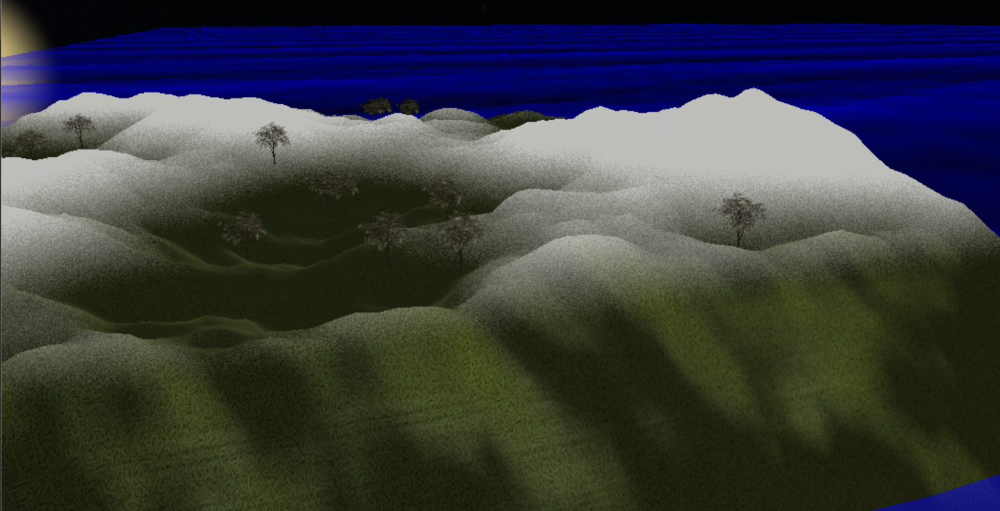
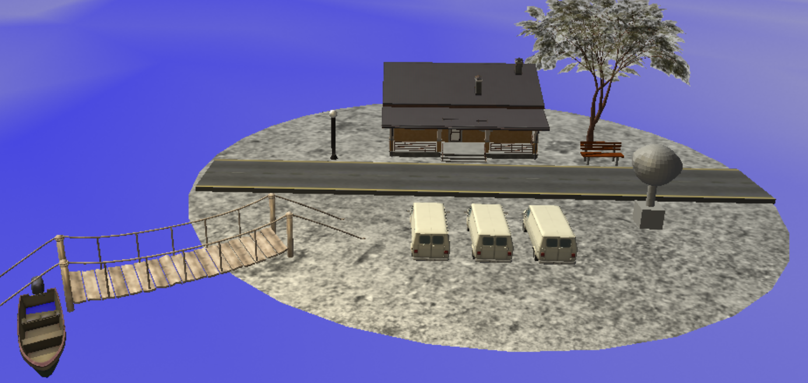
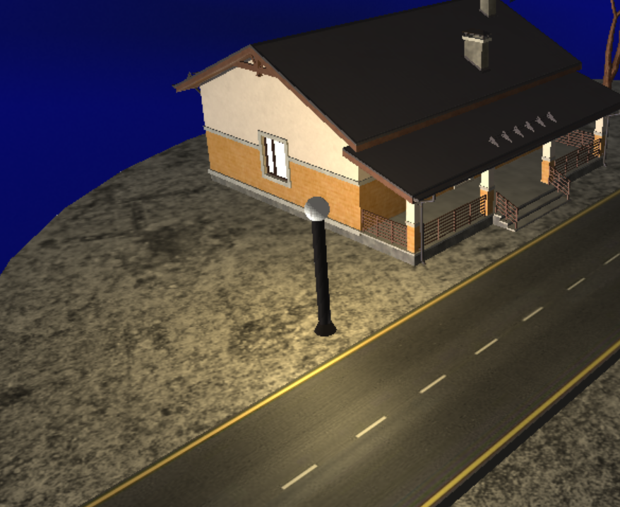
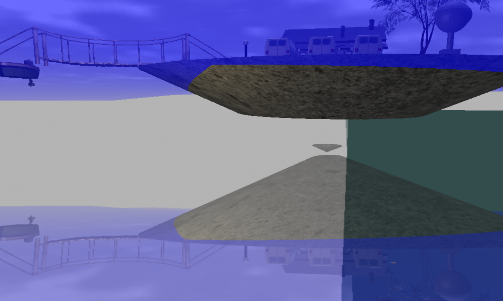
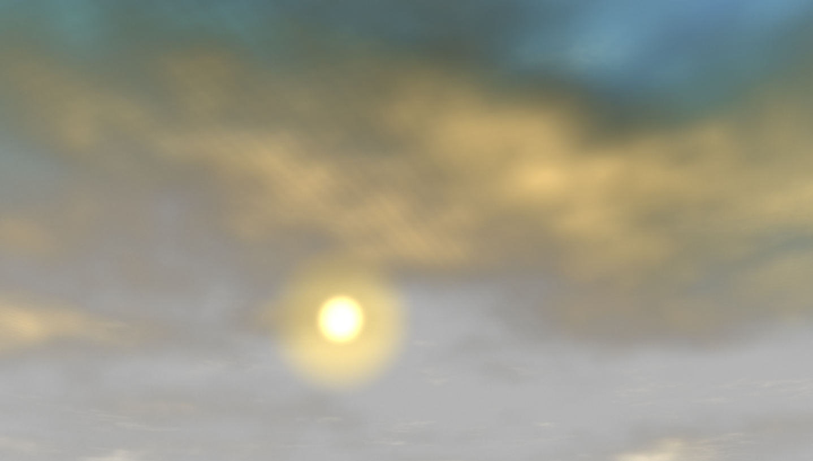

# AM5_LUN

## 🎯 Présentation du projet

AM5_LUN est un projet développé en C/C++ visant à reproduire une scène réaliste.  
Il utilise des shaders GLSL, gkit utilisant OpenGL.
La scène est composée de models 3D avec un rendu réaliste sur le ciel, l'eau et les lumières.
Un terrai est généré procéduralement avec un placement aléatoire d'arbres.


## ▶️ Détails de la scène
> 👉 **Terrain généré**  
>   
>
> 👉 **Île composée de models 3D**  
>   
>
> 👉 **Lumière directionnelle et points de lumière**  
>   
>
> 👉 **Eau et reflets**  
>   
>
> 👉 **Ciel dynamique**  
> 


## 🛠️ Installation & Compilation

### 🔧 Windows avec Visual Studio

> 1️⃣ **Cloner le projet**  
> ```bash
> git clone https://github.com/G5KoNoah/AM5_LUN.git
> cd AM5_LUN
> ```  
>
> 2️⃣ **Générer les fichiers Visual Studio**  
> Exécuter : `premake5.exe vs2022`  
>
> 3️⃣ **Ouvrir Visual Studio**  
> Ouvrir le projet généré dans `build/`  
>
> 4️⃣ **Compiler**  
> Compiler le projet **Scene3D**  
>
> 5️⃣ **Exécuter**  
> Lancer l’exécutable dans `bin/`


### 🔧 Linux

```bash
git clone https://github.com/G5KoNoah/AM5_LUN.git
cd AM5_LUN
premake4 gmake
make Scene3D
cd bin
./Scene3D
```


## 🧱 Architecture

> 📂 **scene/** — Code source principal de la scène complète  
> &emsp;• **water/** — Classes permettant de gerer les framebuffers d'eau  
> &emsp;• **lights/** — Gestion des différentes lumières  
> &emsp;• **shaders/** — Shaders de debug, obsolètes  

> 📂 **shaders/** — Fichiers GLSL vraiment utilisés dans le rendu  

> 📂 **data/** — Fichiers chargés dans la scène  
> &emsp;• Textures (.png, .jpg)  
> &emsp;• Matériaux (.mtl)  
> &emsp;• Models 3D (.obj)


## ✨ Auteurs

- Leonard Benazeth-Lapierre
- Ugo Hong
- Noah Hilaire
